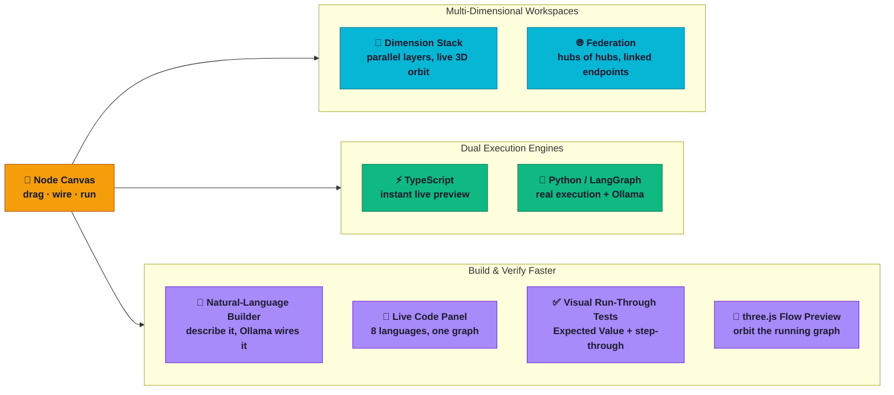

# Geekatplay Studio: LogiTensor

**LogiTensor turns "if this then that" into something you can see, drag, and watch run.** Snap together math, AI calls, loops, and conditions like circuit components — no code required. Every workflow lives in its own *dimension*, dimensions stack into a 3D-navigable *hub*, and hubs link into a *federation* of workflows sharing live data across your entire universe of logic — genuinely multi-dimensional, the way an AI model's tensors are, not just a flat board or a stack of them. Prototype an automation, teach computational thinking, or build a genuinely alive-feeling control system — LogiTensor makes the invisible plumbing of software visible, and fun to build.

Branded and developed by **Geekatplay Studio**.



---

## Recent Fixes

- **Counter state is now serialized per node** so rapid repeated trigger pulses no longer overwrite earlier increments/decrements. Stateful nodes such as the Counter now accumulate correctly across fast back-to-back events instead of getting stuck at 0 or 1.
- **Hybrid data-to-trigger wiring is handled with rising-edge detection** so a boolean/number source only fires when it transitions from off to on, not on every re-evaluation.

## Executive Summary

LogiTensor is a visual, node-based programming environment: logic gates, control flow, math, text processing, and small real neural-network layers all become draggable nodes on a canvas, wired together and executed live. It solves the same core problem as tools like Node-RED or n8n — making control flow and data flow *visible* instead of buried in text — but pushes further into two areas most visual-programming tools don't touch: workflows that are genuinely **multi-dimensional** (parallel workspaces that stack and link, not just one flat canvas), and node types that perform **real, inspectable machine-learning math** (a Dense Layer's weights, a Conv1D Layer's receptive fields) rather than only calling out to an opaque model API.

It was built as both a working tool — for prototyping automations and for teaching computational thinking and basic neural-network mechanics visually — and as a demonstration project: a non-trivial full-stack system with a real architectural spine (dual execution engines, a custom 3D rendering layer, a sandboxed scripting surface) rather than a CRUD app with a chatbot bolted on.

It's technically interesting for a few reasons: it runs **two independent, cross-language execution engines** (TypeScript for instant in-browser preview, Python/LangGraph for actual execution) that must agree bit-for-bit, including on pseudo-random neural-network weights, and are now checked by an automated parity test suite; it renders most of its 3D through hand-written camera/perspective-projection math with **no WebGL dependency**, and adds a genuine `three.js`/`@react-three/fiber` scene only where an orbitable live preview of the running graph earns the extra dependency; it sandboxes **user-authored Python** well enough to run arbitrary "script" nodes safely in a local single-user context; and the same graph the canvas renders is also the input to a **pure, testable code-generation engine** (eight target languages) and to a **local-LLM natural-language flow builder** — both built as thin, validated layers over the existing node/edge model rather than new sources of truth.

## Engineering Challenge

The project's hard problems weren't UI polish — React Flow, Zustand, and Tailwind handle most of that for free. The real engineering challenges were:

- **Execution parity across languages.** A node graph must produce identical results whether it's being live-previewed in the browser (for instant feedback while editing) or actually executed on the backend (for real Python scripts, Ollama calls, and as the source of truth). Two independent implementations of the same ~30 node types have to agree, including on floating-point math and pseudo-random weight generation.
- **Sandboxing arbitrary code without infrastructure.** The Python Script node and the Formula/Expression nodes accept user-authored code, which has to run without a container, VM, or subprocess boundary — using static analysis and expression-grammar restrictions instead.
- **Non-flat program state.** A workflow isn't just nodes and edges — it's nodes and edges *inside a dimension*, dimensions *inside a hub*, hubs *inside a federation*, with some nodes cloned identically across every dimension and evaluated as one. Making that model both efficient and easy to reason about (especially "which copy owns the canonical state") was harder than any individual node's logic.
- **Rendering true 3D without a 3D engine.** Three separate views (the dimension stack, the hub federation, and the neural-network weight viewer) needed real orbit/pan/zoom 3D, but pulling in three.js for a handful of relatively simple scenes would have meant a second rendering paradigm and a meaningfully larger bundle for the whole app.
- **Developer experience under Windows-specific failure modes.** Local dev tooling (port binding, child-process lifecycle) behaves differently enough on Windows that the naive Node.js patterns (`shell: true` process spawning, pre-flight port probing) silently leaked processes and produced false "port free" reads — invisible until they caused real failures.

## Architecture Overview

```
┌─────────────────────────────────── Browser ────────────────────────────────────┐
│  Next.js 16 / React 19  —  resizable [palette | canvas | code] shell            │
│                                                                                    │
│  ┌────────────┐  ┌──────────────────┐  ┌──────────────┐  ┌───────────────────┐ │
│  │  Sidebar /  │  │  React Flow       │  │  3D views     │  │  Code Panel        │ │
│  │  node       │─▶│  canvas           │─▶│  (SVG/Canvas2D│  │  (src/lib/codegen) │ │
│  │  palette    │  │  (@xyflow/react)  │  │  + three.js   │  │  8-language live   │ │
│  └────────────┘  │  nodes + edges     │  │  Flow Preview)│  │  source generation │ │
│  ┌────────────┐  └────────┬──────────┘  └──────────────┘  └───────────────────┘ │
│  │  NL Input   │           │                                                     │
│  │  Bar (Ollama)──────────▶│                                                     │
│  └────────────┘  ┌────────▼──────────┐                                          │
│                    │  Zustand store    │                                         │
│                    │  (slices: graph,  │  ── on every edit ──▶                   │
│                    │  layers, hubs,    │     execution-helpers.ts                │
│                    │  execution)       │     (pure TS re-impl. of                │
│                    └────────┬──────────┘     every node's logic —                │
└─────────────────────────────┼──────────────────  instant live preview) ──────────┘
                               │  POST full graph on "Run Flow"
                               ▼
┌────────────────────────────────── Backend ──────────────────────────────────────┐
│  FastAPI (backend/main.py)         POST /nl-build → backend/nl_builder.py       │
│         │                          (Ollama, schema derived from NODE_DEFINITIONS)│
│         ▼                                                                        │
│  compile_and_run_graph()  →  LangGraph StateGraph      (backend/engine/ package: │
│    - trigger wiring → graph edges                       state · helpers · nn_math│
│    - If/Else, loops → conditional edges                 · passive · active ·     │
│    - node logic → execute_logic_computation() /          compile — mirrors        │
│      run_node_task() (parity-tested against              execution-helpers.ts,    │
│      execution-helpers.ts via pytest, backend/tests/)     one file per concern)   │
│         │                                                                        │
│         ▼                                                                        │
│  real I/O: sandboxed Python Script nodes, Ollama LLM/VLM calls                   │
│         │                                                                        │
│         └── logs + node outputs streamed back → painted onto canvas ─────────────┘
```

**Data flow, concretely:** editing a node in the browser mutates the Zustand store, which triggers `evaluateNode()` — a spreadsheet-style incremental recalculation that re-evaluates just the changed node and walks its downstream edges, using the pure-TypeScript node implementations in `execution-helpers.ts`. The same store powers a pure `generateCode(nodes, edges, target)` function (`src/lib/codegen/`) that reads the live graph and emits real source in eight languages, and a `materializeNlGraph()` validator that turns an Ollama-proposed graph (from the natural-language input bar) into real nodes/edges — never trusting the model's output past a schema check. Nothing touches the network for the *canvas* until the user clicks **Run Flow**, at which point the entire graph (all layers) is serialized to JSON and POSTed to FastAPI, which compiles it into a LangGraph `StateGraph` and actually executes it — including anything the browser can't do safely or at all (running arbitrary Python, calling a local Ollama model). Results and log lines stream back and are written onto the same node objects the canvas already renders, so the live-preview and "real run" states share one visual language.

## Technology Choices

Technology was picked to fit the problem, not to look impressive on a list — here's the reasoning, including what was rejected:

- **Next.js + React** over a plain Vite/React SPA: the whole product surface is a single interactive canvas page, so SSR/SEO weren't drivers — the App Router's file conventions and built-in dev server were simply sufficient, and adding a second build tool for effectively no benefit wasn't justified.
- **@xyflow/react (React Flow)** over a hand-rolled canvas/SVG graph editor: React Flow already solves pan/zoom, drag/select, connection validation, and custom node rendering, which are exactly the primitives every node type needs. Rebuilding hit-testing and drag-thresholds from scratch would have spent the project's whole engineering budget on infrastructure instead of the actual differentiators — the 3D views, the dual execution engines, the node semantics.
- **Zustand** over Redux or React Context: the store holds a large, frequently-mutated graph with imperative, recursive actions (`evaluateNode` calling itself on downstream nodes). Zustand's flat `set`/`get` API without reducer/action-creator boilerplate fits an evaluation-engine-shaped store far better than Redux's normalized-reducer pattern; Context was rejected outright — it isn't built for high-frequency updates outside React's render batching, which a live node graph constantly produces.
- **FastAPI + LangGraph** over a Node.js-only backend: two constraints forced Python specifically — the Python Script node needs a real Python interpreter to execute user code, and Ollama's first-class client library is Python. LangGraph was chosen over a bespoke graph executor because trigger-driven node graphs with branches and loops map directly onto LangGraph's `StateGraph` and conditional-edges primitives — using it turned "safely execute an arbitrary DAG with branches and cycles" from custom code into calling a library purpose-built for exactly that.
- **No three.js/WebGL** for the 3D views: every 3D scene in the app tops out at a few thousand primitives, well within what SVG or Canvas2D can push at 60fps with hand-written perspective projection (`project()` in `stack-3d-math.ts` is ~40 lines of trig). Adding three.js would mean a second rendering paradigm and a real bundle-size cost for scenes this simple.
- **A deterministic PRNG (mulberry32)** instead of `Math.random()` / `random.random()` for neural-network weights: weights must be identical between the instant client-side preview and the authoritative server-side run, or the "watch the network run" feature would visibly lie — showing one set of weights while computing with another. mulberry32 was chosen specifically because its single 32-bit state word and ~5-line body make a bit-for-bit cross-language port easy to write and to verify (confirmed via matching output sequences for fixed seeds across both implementations).

## Key Engineering Decisions

- **Dual execution engines as a deliberate design, not technical debt.** Every node type is implemented twice — once in `execution-helpers.ts` for instant preview, once in `backend/engine/passive.py`/`active.py` for real execution — with an explicit code-comment contract ("change one, you must change both") rather than a shared runtime abstraction (e.g. transpiling one to the other, or a WASM bridge). The two engines have fundamentally different jobs — synchronous UI feedback vs. real external I/O — and at this project's size (~46 node types), plain duplication is more inspectable and debuggable than an abstraction layer would be; a parity test suite (`backend/tests/`) now guards the two from silently drifting apart.
- **The graph *is* the serialization format.** Nodes and edges are plain React-Flow-shaped objects, not a custom normalized schema, so the entire workflow round-trips to JSON for save/load and for the backend's request body with zero translation layer.
- **The "Enabled" bypass is table-driven, not a generic flag.** Rather than a universal "skip this node" boolean, each bypassable node type declares its own `(primaryInput, primaryOutput)` pair in a lookup table, mirrored on both engines — because "doing nothing" means something different per node (a Filter's identity is its `value` port, not its `search` port), and an explicit table keeps that mapping auditable in one place instead of buried in conditionals.
- **Sparse connectivity reuses the dense rendering path.** A Conv1D Layer's local receptive-field connectivity is expressed as an ordinary dense weight matrix that happens to be mostly zero, rather than a second sparse code path through the rendering/3D pipeline — trading some wasted memory for reusing already-correct, already-tested rendering code.
- **Node config doubles as runtime state.** Stateful nodes (counters, the LIF neuron's membrane potential, a pixelated image's cached cell values) store that state directly in `node.data.config` instead of a separate runtime-state store — so it saves, loads, copies, pastes, and undoes for free as part of the node object itself, with no parallel state system to keep in sync.

## Tradeoffs

- **Dual-engine duplication** — *benefit:* engine independence and inspectability; each engine can be read start-to-finish without indirection. *Cost:* a bug can exist in one engine and not the other. This is now guarded by an automated parity suite (`backend/tests/test_passive_parity.py`) that runs every `execution-helpers.test.ts` case through the Python engine and asserts identical output — it caught a real divergence (string-concatenation coercion in the Formula node) the first time it ran. Still worth budgeting for: the suite covers passive/reactive node logic, not the trigger-driven side.
- **Zustand store split into slices** — the store now composes five focused slices (`store/graph-slice.ts`, `layers-slice.ts`, `hubs-slice.ts`, `execution-slice.ts`, `persistence-slice.ts`) plus shared pure helpers, each under the repo's 500-line guardrail — closing what was previously the one deliberate exception to that rule. *Cost:* cross-slice calls go through `get()`/`set()` rather than direct references, which is Zustand's normal multi-slice idiom but is one more layer of indirection than a single flat store.
- **No WebGL/three.js** — *benefit:* smaller bundle, one rendering mental model across the whole app. *Cost:* a real ceiling on scene complexity — the AI Model 3D viewer already needed connection-sampling and alpha-scaling heuristics to stay legible past a few thousand simultaneous lines. Acceptable because these visualizations are meant to be intelligible at a glance, not photorealistic scenes with tens of thousands of objects.
- **No database or persistence backend** — *benefit:* the simplest possible reliability story; nothing to run, nothing to fall out of sync. *Cost:* no multi-user collaboration, no versioning, no auth — workflows live in browser memory plus manual JSON export/import. Deliberately out of scope: the project set out to demonstrate visual programming and execution semantics, not to be a SaaS platform.
- **AST-allowlist sandboxing instead of real process isolation** — *benefit:* zero infrastructure dependency, fast to implement and reason about. *Cost:* it's a blocklist-style boundary (deny known-dangerous modules/builtins/dunders), not true isolation. Acceptable for a local, single-user dev tool; explicitly **not** safe for multi-tenant or publicly exposed deployment as-is, and documented as such rather than glossed over.

## Interesting Technical Problems

- **Keeping two languages' PRNGs bit-identical.** mulberry32's bitwise operations (`>>> 0`, `Math.imul`) behave differently under Python's arbitrary-precision integers unless every intermediate value is explicitly masked to 32 bits (`& 0xFFFFFFFF`). Getting this right required porting the algorithm operation-by-operation and verifying matching output sequences for fixed seeds across both languages — a five-line function that's easy to get subtly, silently wrong.
- **Mapping dynamically-wired branches onto LangGraph's static conditional-edge API.** `add_conditional_edges` expects a routing function returning from a fixed, named set of paths, but this app's If/Else nodes might have only one branch wired (no False path, say) — the routing function has to fall back to LangGraph's `END` sentinel per-branch rather than assuming every named path resolves to a real downstream node.
- **A metric that broke the moment a new node shape existed.** The 3D weight-viewer's "N real connections" label assumed every weight matrix was fully dense (`rows × cols`) — correct for Dense Layer, silently wrong for Conv1D Layer's mostly-zero local-receptive-field matrix (it reported 15,872 when only 744 connections were actually nonzero). The fix — count nonzero entries directly instead of trusting matrix dimensions — is a small reminder that metrics derived from a data structure's *shape* rather than its *content* break the moment a new structural variant shows up.
- **Windows-specific child-process leaks in the dev launcher.** `child_process.spawn(..., { shell: true })` spawns an intermediate `cmd.exe` on Windows, so calling `.kill()` on the returned handle kills the shell but leaves the real grandchild process (a lingering `next start` or `uvicorn`) running and holding its port — invisible until the *next* `npm run dev` fails to bind. Diagnosed by cross-referencing `Get-NetTCPConnection` against `Win32_Process.CommandLine` to identify the orphans, then fixed at the source: the launcher now detects an actual bind failure and retries on the next port, rather than trusting a pre-flight port probe (which has its own false-negative failure mode under Windows' address-family binding rules).

## Performance & Scalability

- **Live evaluation is incremental, not a full-graph recompute.** Editing one node's value re-evaluates only that node and walks its downstream edges — spreadsheet-style dependency recalculation — so canvas responsiveness scales with the size of the *affected* subgraph, not the total graph.
- **3D rendering degrades on purpose, not by accident.** The AI Model weight viewer moved from SVG (one DOM node per line, chokes past a few hundred connections) to Canvas2D specifically to handle real graphs — verified live at 8,192 simultaneous connections — and caps rendering at 40,000 connections per hop with sampling beyond that: a deliberate, documented ceiling instead of a renderer that degrades unpredictably.
- **The backend is stateless per request.** The whole graph is sent and recompiled into a LangGraph on every "Run Flow" — simplest possible correctness story, but graph-compilation cost is `O(nodes + edges)` with no caching between runs, a known ceiling if workflows grow very large or run in tight loops.
- **A standing 500-line-per-file guardrail** (enforced in `AGENTS.md`) keeps the codebase navigable as node types multiply — new node categories consistently get their own body/execution files (e.g. `ai-model-parts/`, `dense-layer-3d-view.tsx`), and the two largest files that once broke this rule (the Zustand store, the Python execution engine) are now split into cooperating modules that all individually satisfy it (see Tradeoffs).

## Lessons Learned

- **What worked well:** keeping each concern — node type definitions, execution logic, UI config panels — in one predictable file per concern (rather than one file per node type) made adding new node types fast and low-risk. Several new node types (Threshold Neuron, LIF Neuron, Conv1D Layer, Range, Expected Value) landed in single focused sessions by following the established pattern, without touching unrelated code. The same held true for the Zustand store and Python engine splits — each collapsed cleanly into cooperating modules (slices, `backend/engine/`) once the split was actually done, confirming the "should have shipped this way" instinct below.
- **What was redesigned:** the central Zustand store is now split into cooperating slices (graph, layers, hubs, execution, persistence) instead of one 1,600-line file, and `backend/execution_engine.py` into a `backend/engine/` package (`state`, `helpers`, `nn_math`, `passive`, `active`, `compile`) behind a compatibility shim so nothing importing the old path broke.
- **The reliability gap that's now closed:** dual-engine duplication now has a shared parity harness (`backend/tests/`) — every passive/reactive node case from the TypeScript suite runs through the Python engine and asserts an identical result. It caught a real bug on its first run. The gap that remains: trigger-driven (stateful, side-effecting) node logic isn't covered the same way, since the Python engine deliberately treats that as frontend-owned state it reflects rather than recomputes.
- **Future improvements:** real sandboxing (subprocess isolation or WASM) for user-authored Python before any multi-user or hosted deployment; a persistence layer if collaboration or workflow history becomes a goal; extending parity testing to the trigger-driven path; and widening the code-generation panel's native emitters (currently TypeScript/JavaScript and Python) to more languages as demand shows up, rather than leaning further on the line-adapter approach used for C/C++/Go/Rust/PHP today.

---

## Key Features

### 1. Unified Next.js + LangGraph Runtime
- **Frontend Canvas**: Driven by `@xyflow/react` (XYFlow) with a sleek, dark glassmorphic UI.
- **Stateful Python Backend**: Powered by FastAPI and **LangGraph (`StateGraph`)**, compiling visual nodes and connections into stateful execution threads.
- **Asynchronous & Loop Runs**: Run workflows asynchronously, including looping runs (1-100 loops) staggered in real-time by a Delay Slider. Unreachable/orphaned nodes are skipped with a log line instead of failing the whole run.

### 2. Multi-Dimensional Workspaces (3D Layers)
- **Parallel Spaces**: Organize workflows into separate workspaces ("dimensions") that compile and execute in parallel. Add, duplicate, rename, and delete dimensions from the layer selector; step between them with prev/next arrows.
- **3D X-Ray Dimension Stack**: Every dimension renders as a translucent plane in real 3D world space — drag to orbit, scroll to zoom, click a plane to pull it forward and inspect its actual nodes and wiring; neighboring dimensions stay visible but dimmed, blurred, and desaturated ("x-rayed") behind it.
- **Dimensional Bridges**: Toggle any node's globe icon to make it "multi-dimensional":
  - It's cloned into every other dimension (same position, same config) and glows with a cyan ring, with a glowing connector threading vertically through the stack between every copy.
  - Each dimension's copy is evaluated together: matching input ports are combined across all dimensions (numbers sum, booleans OR, strings join), the node computes once, and the single result is broadcast back to every dimension's output.
  - Unchecking removes every clone and leaves the node living only in its original dimension — regardless of which copy you toggled it from.

### 3. Federation (Hubs)
- **Hubs**: A hub is a complete, named multi-dimensional workflow — a collection of dimensions. Create, duplicate, rename, and delete hubs just like dimensions.
- **Zoom out to the Federation**: Scroll far enough out of the dimension stack (or click the Federation toggle) and hubs collapse into glowing wireframe cubes floating in 3D, each showing its dimensions as glass slices inside.
- **Federation Endpoints**: Mark a node as a federation link (network icon) to connect it, by name, to matching endpoints in other hubs — a live channel connection rendered as a pulsing curve between hub cubes.

### 4. Smart Canvas Sockets & Collapsible Palette
- **Color-Coded Node Palette**: Sidebar category groups and node cards share the exact color family as the node headers they add to the canvas. Every category header is now **collapsible** (with a live count badge) for a cleaner sidebar — search automatically expands matching groups.
- **Double-Socket Architecture**:
  - *Trigger Sockets (Chevron ▷)*: Pulsating amber flow path.
  - *Data Sockets (Circle ○)*: Type-specific colored connections carrying numbers, text, or booleans.
- **Hover Help Tooltips**: Hover over any connector socket to read its name, data type expectations, and routing behavior.
- **Right-Click Disconnection**: Right-click on any socket instantly disconnects all linked wires.
- **Concentric Radial Menu**: Right-click anywhere on the canvas to open a radial category selector to drop nodes exactly where clicked.

### 5. Advanced Node Library
**79 node types across 11 categories.** Every one is implemented twice (TypeScript for live preview, Python for real execution) and parity-tested against its twin.

- **Inputs**: Manual Trigger, Constants (Number, Boolean, String), **Slider** (min/max/step), **Text Area** (multiline), **Current Time** (epoch ms + formatted).
- **Logic Gates**: AND, OR, NOT, XOR, NOR, NAND, **XNOR**, **Toggle** (each trigger flips a stored boolean), **Latch** (SR: Set/Reset hold a state).
- **Control Flow**: Delay, Increment/Decrement Counter, **Range** (checks whether a Value falls inside Min/Max — `Above`/`Below`/`In Range` outputs recompute live; its own `Count` increments/decrements on each `Check`), **Gate** (trigger passes only while its `open` boolean is true), **Once** (passes the first trigger only, re-armable), **Sequence** (one trigger in, fires three outputs in order), **If / Else Trigger** (its `Check` input evaluates `Condition` — type `true`/`false` or an expression like `a > b`, or wire in a boolean output — and routes to `If` or `Else`), Conditional Value (switches data value), **For Loop** (fires its Body trigger a fixed number of times with a live Index), **While Loop** (fires Body while its Condition stays true, re-checked every pass, with a 1000-iteration safety cap).
- **Math & Compare**: Compare Values (`==`, `!=`, `<`, `<=`, `>`, `>=`), Safe Expression, **Formula** (free-form expressions over inputs that grow new lettered ports — a, b, c… — automatically as you wire them up; numbers compute, strings concatenate), **Math Function** (abs, round, floor, ceil, sqrt, pow, min, max, mod), Random Number, **Clamp**, **Map Range** (remap between two ranges), **Lerp**, **Between** (pure in-range boolean), **Round To** (N decimals).
- **Data & Text**: **Filter** (passes a value through only if it includes/excludes a search term, case-sensitive optional), Text Transform (uppercase/lowercase/trim/length/reverse), Text Replace, **Split** (by delimiter, whitespace, or lines) / **Join**, **Substring**, **Template** (fills `{a}`/`{b}` placeholders from auto-growing inputs), **JSON Parse** / **Stringify**, **To Number** / **To String** / **To Boolean**, **Regex Match**.
- **Lists**: **Append** (accumulates values into an array, with reset), **Length**, **Get** (index, negative counts from the end), **Stats** (sum/avg/min/max/count), **Sort** (numeric or lexical, asc/desc), **Slice**, **Contains**, **Frequency** (groups identical entries and ranks them most-used first — values, parallel counts, a ready-to-display `item: count` report, and a distinct-count; ties broken by first appearance so both engines agree), **Unique**, **Count Item**.
- **Outputs**: Console Logger, Text Output (resizable display), **Value List** (accumulates each incoming value as a new line, with Clear), **Gauge** (renders a number as a bar between Min and Max), **Expected Value** (compares Value to Expected and exposes a Pass boolean — the assertion node **Run Tests** fires and grades; see §8).
- **Hybrid trigger ports**: any trigger input (Inc/Dec, Check, Log, Step, …) also accepts a wired boolean or number directly — `true`/positive numbers fire it, `false`/zero don't — so a Compare or Range node can drive execution flow without a separate pulse node in between. Fires once per rising edge (off→on), not on every re-evaluation.
- **AI & Scripts**:
  - *Python Script*: Executes sandboxed scripts. Injects inputs `x` and `y` and retrieves `result`.
  - *Ollama LLM*: Queries local models (e.g. `llama3`) with prompt templates.
  - *Ollama VLM*: Queries local vision models (e.g. `llava`) with prompts and image references.
- **Neural Network**: Biologically-inspired computation nodes —
  - *Threshold Neuron*: Fires (and passes its Value through) only when Value crosses a configurable Threshold; a switch picks Above or Below.
  - *Max Selector*: Winner-take-all — auto-growing inputs (a, b, c…), outputs whichever connected value is highest, like lateral inhibition.
  - *Synapse*: Scales a signal by a Weight; an Inhibitory switch flips the connection to subtract instead of add.
  - *LIF Neuron*: A real leaky integrate-and-fire model — each Step adds Input to a membrane Potential that decays by Leak, firing Spike and resetting once Threshold is crossed.
- **AI Model**: A small visual neural network you build and watch run —
  - *Image Input Grid*: Upload an image and pixelate it onto an N×N grid (4×4 up to 32×32); each cell becomes the average color and luminosity of that region, forming the network's input vector.
  - *Dense Layer*: A fully-connected layer — every incoming value feeds every neuron through its own weight, drawn live inside the node as the classic weight web (amber = positive, teal = negative, opacity by magnitude). Configurable neuron count, activation (Sigmoid/ReLU/Tanh), and a weight seed (weights are deterministically generated from the seed, identical on the frontend and the backend). Chain multiple Dense Layers for hidden layers.
  - *Output Layer*: Renders each incoming activation as a bar and outputs the index of the strongest neuron (the winner).
- **Device Lab**: WiFi Scan/Connect, BLE Scan, USB Serial Send — simulate deterministically on the canvas, compile to real Arduino calls when sent to a device. See §13.
- **Enabled bypass**: Most computation nodes (Logic gates, Math & Compare, Data & Text, Neural Network) carry an `Enabled` boolean input (default `true`). Set it false — directly or by wiring in a boolean — and the node skips its own logic, passing its primary input straight through to its primary output instead, as if it weren't in the graph.

### 6. Natural-Language Flow Builder
- A slim input bar sits above the workspace: describe a flow in a sentence and **Build** sends it, along with a compact JSON schema of every node type (derived straight from `NODE_DEFINITIONS`, never hand-duplicated), to a local **Ollama** model via `POST /nl-build`.
- **Model picker**: `GET /models` lists what's actually installed and ranks capable coder/reasoning models first, so the default is the best model on the machine rather than a hardcoded name. This matters more than it sounds — small chat models reliably wire value outputs into *trigger* ports and emit null edges, producing graphs that look built but do nothing. The system prompt spells out the trigger-vs-data port distinction with a worked example for the same reason.
- The model's response is never trusted directly — `materializeNlGraph()` validates every proposed node type, port, and edge against the real node definitions and drops anything unrecognized. A follow-up `auditConnectivity()` pass then reports unconnected nodes, trigger-driven nodes nothing fires, and unfed inputs, so a technically-valid-but-inert graph is surfaced instead of silently applied.
- **Activity overlay**: a collapsible panel along the bottom narrates the whole build — model chosen, request sent, the model's raw reply verbatim, what validation accepted or rejected, the wiring audit, and the final apply. When a build goes wrong, the reason is visible rather than hidden behind a toast.
- **Replace** or **Add** modes let a request start a fresh board or extend the current one; accepted graphs are auto-laid-out left-to-right by topological depth.

### 7. Live Multi-Language Code Panel
- A collapsible, resizable right-hand panel renders the current canvas graph as real source code, live, with a language dropdown: **TypeScript, JavaScript, Python, C, C++, Go, Rust, PHP**. It follows the canvas continuously — building, editing, or **loading a saved flow** repopulates it immediately.
- **Edit mode (code → graph)**: click the pencil to detach the panel and hand-edit the source, then **Apply** to rebuild the canvas from it. Because deterministic parsers for eight languages aren't practical, Apply routes the edited code through the same local-Ollama-plus-schema-validation path as the natural-language builder — the model proposes a graph, and nothing reaches the canvas until every node type, port, and edge is verified against `NODE_DEFINITIONS`. It's a best-effort conversion by design, and says so.
- TypeScript/JavaScript and Python are **native emitters** — one small per-node-type contract (`setup`/`loop`/`outputs`) shared across ~46 node types, so trigger chains become real `if`/loop/function statements and data wiring becomes threaded expressions, not templated strings. C/C++/Go/Rust/PHP are **derived** from the JavaScript emission through a deterministic line-adapter (rule table + honest `TODO(port by hand)` bailouts for constructs that don't map cleanly) — the same approach Geekatplay Studio's ASH-Mesh Device Logic Studio uses, extended from its original 4-language, 2-native-emitter design.
- Syntax highlighting via `shiki`; copy-to-clipboard; any node the generator couldn't fully compile surfaces as an in-panel warning instead of silently producing wrong code.

### 8. Visual Run-Through Testing
- **Step-by-step highlighting**: the backend returns the real execution order, and the canvas replays it one node at a time — so you see *which node is running now*, not the whole graph turning green at once. The **Delay** slider paces that replay in real time (set it to 0 for an instant run).
- **Run Tests** (flask icon) fires every Manual Trigger live on the canvas — the same animated, value-labeled execution path as normal interactive use — then grades every **Expected Value** node and reports a pass/fail summary.
- **Live values on every wire**: data edges show a value pill during interactive runs (previously only the backend's Run Flow did) — colors and labels are driven by one shared styling helper so the two execution paths look identical.
- **Pause / Step**: pause mid-run and advance one node at a time to watch exactly what fires and in what order.

### 9. three.js Flow 3D Preview
- An orbitable WebGL scene (`@react-three/fiber` + `drei`) renders the live graph as boxes and connecting lines you can drag to orbit — running nodes glow amber, errored nodes flush red, in real time as a flow executes. The app's first genuine three.js surface, added deliberately alongside — not in place of — the existing hand-rolled SVG/Canvas2D 3D views, which stay for the scenes they already handle well.

### 10. Resizable, Collapsible Workspace
- The palette, canvas, and code panel are three `react-resizable-panels` panes — drag any divider to resize, or drag past a panel's minimum to collapse it out of the way.
- The header toolbar is icon-first with hover tooltips (Run, Run Tests, Pause/Step, Loops, Delay, Reset, Clear, Save/Load, 3D Preview, Help, About) to stay compact at any panel width.

### 11. Canvas Editing
- **Multi-select**: Ctrl/Cmd+click to add nodes to a selection (native React Flow behavior — also works with a drag-select rectangle).
- **Copy / Paste**: Ctrl/Cmd+C copies the selected nodes plus any wiring entirely within the selection; Ctrl/Cmd+V pastes them offset from the originals, freshly wired, and selected.
- **Delete**: Delete/Backspace removes the selected node(s) along with their connected edges (and any multi-dimensional clones), skipped while typing in a text field so it never hijacks normal editing.
- **Radial node library**: right-click anywhere on the canvas for a two-level circular menu — categories on the inner ring (derived live from the node registry, each with an icon matching what it actually does), then that category's nodes on an outer ring that grows with the node count. Categories open on **hover**, not click. Clamped to the viewport so it never renders off-screen.

### 12. Multi-Layer Sandbox Security
- **Python AST Scanner**: Custom scripts are statically scanned using Python's Abstract Syntax Tree parser. Blocks dangerous modules (`os`, `sys`, `subprocess`, `requests`), builtins (`eval`, `exec`, `open`), and dunder properties.
- **JS/Python Expression Sandbox**: Math and Formula nodes run a token-based Shunting-yard calculator, isolating execution threads from window/interpreter global spaces, mirrored identically on both the frontend and the backend.

### 13. Device Lab — real hardware, real security
- A dedicated screen (`/device-lab`) for building and flashing real ESP32 firmware, talking to it over **WiFi or Bluetooth**, and controlling it from a **desktop panel or a cross-platform phone app (iPhone + Android)** — the node canvas's "logic" made physical.
- **USB workflow**: auto-detects a board the moment it's plugged in, builds with `arduino-cli` and flashes with `esptool` as polled backend jobs, reads a board's flash back into a downloadable image, and runs one-click "Sync device" (build + flash together). A **Device check** panel identifies the chip itself (works on any firmware, or none) and asks a running firmware to prove itself alive with `ping`/`info`/`test` — the last one grabbing a real camera frame and reporting timing, WiFi, and memory.
- **Reference firmware** (`firmware/esp32video/`): an ESP32 camera module that serves an MJPEG stream, advertises over BLE for phone discovery, and can join a home WiFi network at runtime (BLE or HTTP command, saved to NVS) — with its own always-on access point as a permanent fallback.
- **Consumer-grade command security, not an afterthought**: every command (flash an LED, echo data, run diagnostics) requires a fresh single-use nonce plus an `HMAC-SHA256` signature from a per-device key that's generated once, baked into firmware at build time via a redacted compiler define, and never stored in plaintext on the phone (iOS Keychain / Android Keystore only). A **"send a forged command"** button lets you watch the device reject a tampered signature live. The desktop panel and the phone app share one `CommandChannel`/`DeviceTransport` abstraction (`src/lib/device-lab/transport/`, mirrored in the mobile app) so WiFi and Bluetooth get identical guarantees — a transport moves bytes and never sees a key. See [`docs/DEVICE_LAB.md`](./docs/DEVICE_LAB.md) for the architecture and [`docs/SECURITY_CASE_STUDY.md`](./docs/SECURITY_CASE_STUDY.md) for the real-world failures (Mirai, Ring, Wyze, Verkada, Eufy, BLE relay attacks) this design deliberately avoids.
- **Same dual-engine, same node system**: WiFi/BLE/serial connectivity nodes (`src/types/node-definitions/device-lab.ts`) simulate deterministically on the canvas — parity-tested against a Python mirror like every other node type — and compile to real Arduino calls (`src/lib/device-lab/firmware-codegen.ts`) when sent to a device.

### 14. In-App Help & About
- A **Help** panel (top toolbar) walks through building flows, the node library, dimensions, the 3D stack, and federation.
- An **About** panel carries the LogiTensor pitch and Geekatplay Studio background, plus a link back to this repository.

---

## Installation & Setup

### Prerequisites
1. **Node.js** (v18+) & npm.
2. **Python** (v3.10+) with `pip`.
3. **Ollama** installed and running locally — required for the Ollama LLM/VLM nodes *and* for the natural-language flow builder (`POST /nl-build`), which is unusable without it.

### Setup Stack
Run our automatic bootstrapper to build the Python virtual environment and configure models:
```bash
npm run setup
```

### Launch Development Stack
Launch Next.js (port 3000) and the FastAPI backend (port 8000) in parallel:
```bash
npm run dev
```
Open [http://localhost:3000](http://localhost:3000) in your browser. The page fills the browser window responsively (using dynamic viewport height) and reflows live as you resize it.

If port 3000 or 8000 is already taken, the startup script automatically retries on the next port up (3001, 8001, …) and wires the frontend to whichever backend port actually started — no manual port-juggling required.

### Verification tests
To verify front-end calculations (including the codegen and hybrid-trigger suites):
```bash
npm run test
```
Also available: `npm run typecheck` (`tsc --noEmit`) and `npm run lint` (ESLint).

To run the backend, including the TS↔Python **parity suite** that checks both execution engines agree node-for-node:
```bash
python -m pytest
```

A GitHub Actions workflow (`.github/workflows/ci.yml`) runs lint, typecheck, `npm test`, `npm run build`, and `pytest` on every push and pull request.

---

## Roadmap

[`ROADMAP.md`](./ROADMAP.md) is the design record for the multi-language code panel, natural-language builder, visual run-through testing, three.js preview, and the module-size cleanup — grounded in a full audit of this repo (and of Geekatplay Studio's ASH-Mesh Device Logic Studio, the reference for the code-generation architecture). All phases in it are implemented.

## Device Lab documentation

- [`docs/DEVICE_LAB.md`](./docs/DEVICE_LAB.md) — the communication-layer architecture (`CommandChannel` / `DeviceTransport` / `CommandSigner`), a step-by-step guide to pairing a device, and to adding a new transport or command.
- [`docs/SECURITY_CASE_STUDY.md`](./docs/SECURITY_CASE_STUDY.md) — a case study on consumer IoT security: what went wrong at Mirai-botnet scale and at Ring, Wyze, Verkada, and Eufy specifically, the industry baseline (OWASP IoT Top Ten / ETSI EN 303 645), how this project's design answers each failure pattern, and an honest list of what it does *not* yet do before it would be shippable hardware.

---
*Branded and developed by Geekatplay Studio.*
